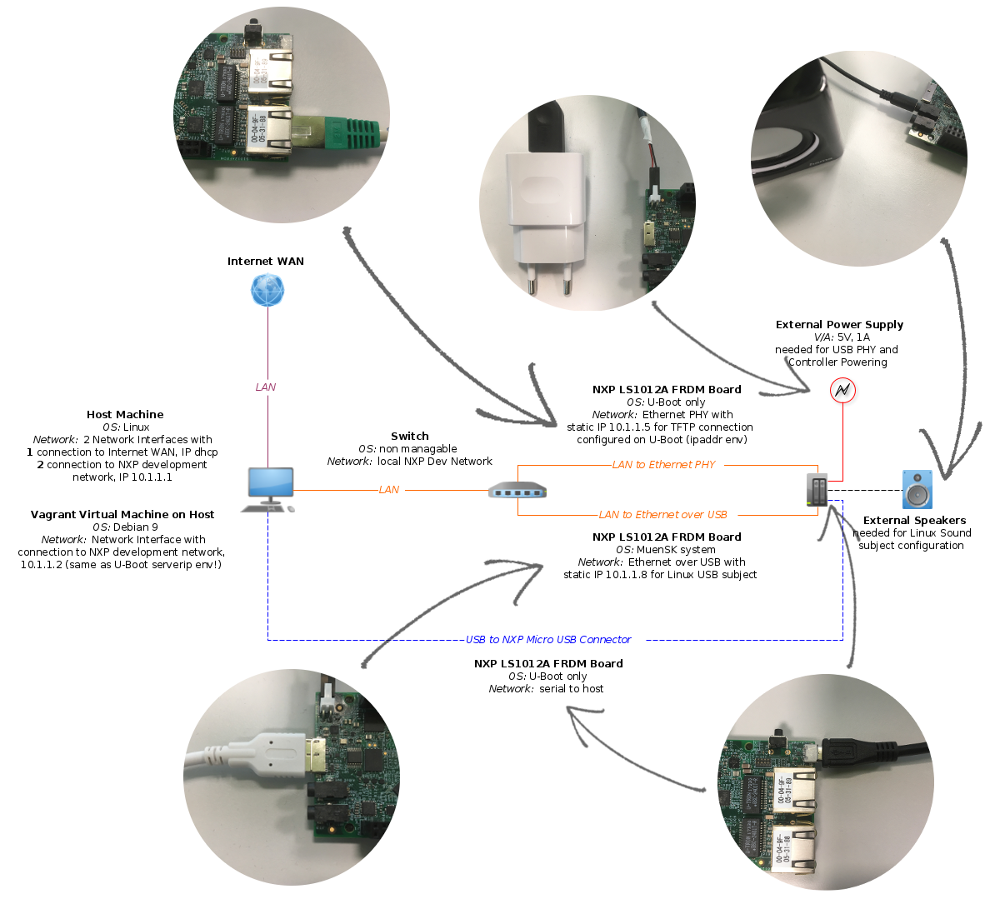

# Muen on ARM - Quickstart Guide #

## Introduction ##
This repository contains the Muen on ARM project. Currently, three different Muen SK system configurations are available - **(1)** a Minimal Linux configuration with a Linux VM subject and a native subject, **(2)** a Sound Linux configuration with a Linux VM subject, that is able to play some audio files, and a native subject and **(3)** a USB Linux configuration with a Linux VM subject, that is accessible via ssh (i.e. openssh) and runs a webserver (i.e. lighttpd) and a native subject. This Quickstart Guide explains how to build and run the project.
&nbsp;
&nbsp;

## Hardware Setup ##
The hardware setup is the most important requirement for a successful build and deployment of this project. Basically the setup consists of the following components:
&nbsp;

* _Host Machine_: **(a)** two network interfaces, one connecting to the internet with a DHCP IP and the other connecting to the NXP Development Network (NDN) with the static IP 10.1.1.1; **(b)** the Vagrant Development Environment VM with one connection to the NDN and the static IP 10.1.1.2.

* _Switch_: to set up the NDN connections between the NXP LS1012A Evaluation Board, the Host Machine and the Vagrant DevEnv VM.

* _NXP LS1012A FRDM_: **(a)** U-Boot connected via the Ethernet PHY Interface to the NDN (esp. Vagrant DevEnv VM); **(b)** Micro USB to USB serial connection between the evaluation board and the Vagrant DevEnv VM; **(c)** USB to Ethernet connection to the NDN for the USB Linux configuration with **(d)** an additionally required External Power Supply (i.e. 5V, 1A) to power the USB Controller and Interface; **(e)** and Audio Jack to external speakers for the Sound Linux configuration.
&nbsp;


&nbsp;

While the setup of the two network interfaces on the Host Machine depends on the OS and is therefore omitted, the U-Boot configuration has to be set as follows:
```
=> printenv
=> setenv bootdelay -1
=> setenv ipaddr 10.1.1.5
=> setenv serverip 10.1.1.2
=> saveenv
=> reset
=> printenv
```
&nbsp;
&nbsp;

## Build and Deployment ##

### Preparation ###
Before starting the build and deployment process, the following software has to be installed:
&nbsp;

* _VirtualBox_: Download and install VirtualBox (tested with version 6.0.10) for the Host Machine's OS, c.f. [Official VirtualBox Download Page](https://www.virtualbox.org/wiki/Downloads).

* _VirtualBox Extension Pack_: Also needs to be installed to be able to pass through the UART USB serial connection, c.f. [Official VirtualBox Download Page](https://www.virtualbox.org/wiki/Downloads).

* _Vagrant_: Download and install Vagrant by HashiCorp, c.f. [Official Vagrant Download Page](https://www.vagrantup.com/downloads.html).
&nbsp;
&nbsp;

### Processing ###
Before working through this paragraph, make sure that the hardware is set up correctly (i.e. Host Machine's network interfaces and the NXP LS1012A U-Boot environment variables).
&nbsp;

1. _Step One_: Place the Vagrantfile, the GNATPro 18.2 AArch64 Toolchain and the two Git ssh keys named 'id_rsa' / 'id_rsa.pub' into one folder.
    
    ```
    -- dir
        |- Vagrantfile
        |- gnatpro-18.2-aarch64-elf-linux64-bin.tar.gz
        |- id_rsa
        |- id_rsa.pub
    ```
    
2. _Step Two_: Run the following commands to setup the Vagrant Development Environment VM and ssh into the automatically booted VM (**NOTE** connect the NXP LS1012A FRDM UART USB connector before executing this commands).
    
    ```
    $ vagrant up
    $ vagrant ssh
    ```
    
3. _Step Three_: Clone the MuenOnARM Git repository and change into the Muen SK code root folder.
    
    ```
    $ git clone git@git.codelabs.ch:/muenonarm.git
    $ cd muenonarm/03_code/01_muensk
    ```

4. _Step Four_: Build and run the project by executing the according script (**NOTE** type --help or -h to get a full usage description). This script **(a)** First builds the given Linux VM subject - during this process the menuconfig target is called for the buildroot, the Linux Kernel and the Busybox system. One should quick check the loaded configurations with *1* 'Buildroot -> System Configuration' must have "Welcome to MuenOnARM" as welcome text; *2* 'Linux Kernel 5.2 -> Platform Selection' the following architectures have to be selected "ARMv8 based Freescale, MuenSK based and ARMv8 based NXB"; *3* 'Busybox -> Network Utilities' USB Linux has to select ifup / ifdown and others, but for Sound and Minimal Linux VM no network packages are selected.
    
    ```
    $ ./build_and_run.sh -t usb -d tftp
    ```
    
&nbsp;
&nbsp;

### Testing ###
To test the deployed MuenSK configurations, one can do the following:

* _Minimal Linux_: This is really a minimal Linux configuration and therefore only supports a log in screen with user 'root' and password 'root'. Of course, some basic programs like `cd, ls, chmod, find, ...` are already available.

* _Sound Linux_: This Linux subject has some support for playing sound (but no network). Run the following commands in the UART console to test it.
    
    ```
    # cd /media/music
    # aplay -f S16_LE -r 44100 -t wav -c 2 harry_potter_short.wav
    # aplay -f S16_LE -r 44100 -t wav -c 2 lord_of_the_rings_short.wav
    # aplay -f S16_LE -r 44100 -t wav -c 2 pirates_of_the_caribbean_short.wav
    ```

* _USB Linux_: This is the only Linux subject that is connected to the NDN network and running OpenSSH and a Webserver. Open a browser on a computer connected to the NDN network and search for the page with the IP 10.1.1.8 or ssh into the machine (user 'root', password 'root', ip 10.1.1.8). Test the separation with an illegal memory access.
    
    ```
    # devmem 0x80000000
    ```

&nbsp;
&nbsp;

### Configuration and Changes ###
To apply some configuration and code changes, do the following:

* _MuenSK_: Open the respective GPS project, change the code and call `make linux<target>` - currently the targets 'linuxminimal', 'linuxsound' and linuxusb' are supported. After every change (incl. subjects code and patches), the MuenSK system image has to be rebuild.

* _Linux Subjects_: To change or configure the Linux VM subjects, one has to change the source code for the buildroot overlay and patches (i.e. `01_muensk/muensubjects/muenlinux/src`, run the script `generate_patchfiles.sh` in the linux subject scriptfolder to generate all patches and overlays for a given configuration and rebuild the buildroot image with the script `build_linuxguest.sh`. All scripts have a usage print function.

* _Native Subjects_: Open the respective GPS project, change the code and call `make all`.

&nbsp;
&nbsp;

The following two topics could be particularly interesting for setting up an adapted build environment:

* _NXP Development Network_: To change the network configuration, one has to first change the U-Boot Environment Variables on the NXP LS1012A FRDM evaluation board, then adapt the Vagrantfile IP address for the Development VM as well as change the Host Machine's interface and finally change the network interface configuration in the Linux Subject source (i.e. network overlay -> etc -> interfaces).

* _Annoying Subject Output_: The simplest way to get rid of the native subject's output to the console is to change the function `Next_Subject` in the MuenSK hypervisor code in the file `sk-scheduling_plan.adb` to always return Subject 1 (i.e. Linux VM subject).

```
function Next_Subject (Current : SSC.Component_ID_Type)
                       return SSC.Component_ID_Type
is
    pragma Unreferenced (Current);
begin
    return SK.Subjects_Configuration.Subject_1;
end Next_Subject;
```

&nbsp;
&nbsp;

## Known Problems ##
* _DMA_: Both, the USB and Sound Linux VM subjects make use of the eDMA controller. Therefore, running both guests together would result in a separation conflict due to missing SMMU support.

* _UART_: Due to hardware restrictions all three components - i.e. the Muen SK hypervisor, the Linux subject and the native subject - make use of the same serial connection. This can sometimes lead to some strange output on the serial console but could be solved by writing a native subject that virtualizes the UART controller.

* _Kermit Scripts_: The kermit scripts are not too reliable. Therefore, one can omit the deploy method when calling the build and run scripts - this only connects to the NXP LS1012A U-Boot console and one can load the MuenSK system manually with
    
    ```
    => tftp 0x96000000 muensk-system.itb
    => imxtract 0x96000000 muensk-1 0x83800000; imxtract 0x96000000 subjectone-1 0x86000000; imxtract 0x96000000 fdt-1 0x90000000; imxtract 0x96000000 kernel-1 0x90080000
    => go 0x83800000
    ```
    
&nbsp;
&nbsp;
