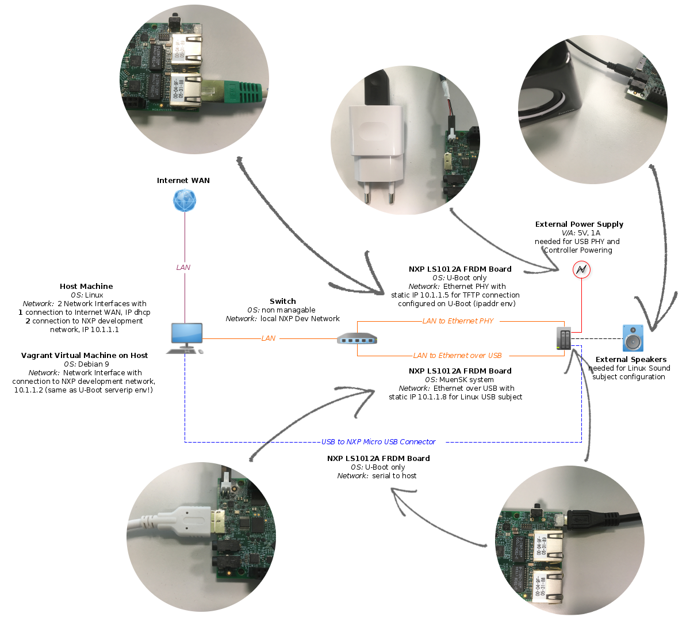

<center class="center">

**Muen On ARM - Quickstart Guide NXP**
*version: 0.0*
</center>

# Introduction

This repository contains the Muen on ARM project. Currently, three different Muen SK system configurations are available for the NXP LS1012A freedom board:

1.  a Minimal Linux configuration with a Linux VM subject and a native subject,

2.  a Sound Linux configuration with a Linux VM subject, that is able to play some audio files, and a native subject and

3.  a USB Linux configuration with a Linux VM subject, that is accessible via ssh (i.e. openssh) and runs a webserver (i.e. lighttpd) and a native subject. This Quickstart Guide explains how to build and run the project.

# Hardware Setup

The hardware setup is the most important requirement for a successful build and deployment of this project. Basically the setup consists of the following components:

-   *Host Machine:* **(a)** two network interfaces, one connecting to the internet with a DHCP IP and the other connecting to the NXP Development Network (NDN) with the static IP 10.1.1.1; **(b)** the Vagrant Development Environment VM with one connection to the NDN and the static IP 10.1.1.2.

-   *Switch:* to set up the NDN connections between the NXP LS1012A Evaluation Board, the Host Machine and the Vagrant DevEnv VM.

-   *NXP LS1012A FRDM:* **(a)** U-Boot connected via the Ethernet PHY Interface to the NDN (esp. Vagrant DevEnv VM); **(b)** Micro USB to USB serial connection between the evaluation board and the Vagrant DevEnv VM; **(c)** USB to Ethernet connection to the NDN for the USB Linux configuration with **(d)** an additionally required External Power Supply (i.e. 5V, 1A) to power the USB Controller and Interface; **(e)** and Audio Jack to external speakers for the Sound Linux configuration.

    <div class="center">

    

    </div>

-   *NXP Bootloader:* While the setup of the two network interfaces on the Host Machine depends on the OS and is therefore omitted, the U-Boot configuration has to be set as follows.

    ``` bash
    > printenv
    > setenv bootdelay -1
    > setenv ipaddr 10.1.1.5
    > setenv serverip 10.1.1.2
    > saveenv
    > reset
    > printenv
    ```

# Build Environment Setup

Before starting the build and deployment process, the following software has to be installed:

-   *VirtualBox:* Download and install VirtualBox (tested with version 6.0.10) for the Host Machine’s OS, c.f. [Official VirtualBox Download Page](https://www.virtualbox.org/wiki/Downloads).

-   *VirtualBox Extension Pack:* Also needs to be installed to be able to pass through the UART USB serial connection, c.f. [Official VirtualBox Download Page](https://www.virtualbox.org/wiki/Downloads).

-   *Vagrant:* Download and install Vagrant by HashiCorp, c.f. [Official Vagrant Download Page](https://www.vagrantup.com/downloads.html) (**NOTE** - Vagrant has to be current enough, e.g. the versions provided by the official Debian Stretch apt repositories are to old).

-   *muenbuild.box:* Download the Vagrant base box with a full install of all the necessary tools (incl. ARMv8-A Ada toolchain) from [here](https://sinv-56021.edu.hsr.ch/downloads). User name and password can be obtained from the programmer - but only internal usage is permitted.

After a successful installation of the above mentioned software, the Vagrant Development Environment VM has to be set up as follows:

1.  *Step One:* Place the Vagrantfile, the muenbuild.box and the two Git ssh keys named ’id_rsa’ / ’id_rsa.pub’ into one folder.

    ``` bash
    |- dir
        |- Vagrantfile
        |- muenbuild.box
        |- id_rsa
        |- id_rsa.pub
    ```

2.  *Step Two:* Run the following commands in the Vagrantfile directory to add the custom muenbuild box to Vagrant, to start the Vagrant Development Environment VM and to ssh into the automatically booted VM (**NOTE** - connect the NXP LS1012A FRDM UART USB connector before executing this commands).

    ``` bash
    $ vagrant box add --name muenbuild ./muenbuild.box
    $ vagrant up
    $ vagrant ssh
    ```

# NXP Board Setup

Before starting with the build of this project, the pre-boot loader and U-Boot binaries have to be updated via the TFTP server and written to the QSPI flash memory of the NXP LS1012A FRDM Board. The two binaries have to be copied from the script directory in the u-boot folder of the Muen SK repository to the TFTP folder of the Vagrant build environment (i.e. `/srv/tftp`). Updating the board can then be achieved with:

1.  by connecting the evaluation board with the Micro USB to USB cable to the development computer and starting the a serial console with the script from the repository,

2.  by resetting the board, stopping the autoboot and entering the U-Boot prompt,

3.  by setting the U-Boot environment variables with the correct IP addresses for the NXP LS1012A FRDM Board and the TFTP server and resetting the board again (as described above);

4.  and, last, overwrite the PBL and U-Boot binary on the QSPI flash memory.

``` bash
# Environment Setup Check #
> printenv

# PBL Update #
> tftp 0x80000000 PBL_0x33_0x05_800_250_1000_default.bin
> sf probe 0:0; sf erase 0 40000; sf write 0x80000000 0x0 40000;

# U - Boot Update #
> tftp 0x80000000 u-boot.bin
> sf probe 0:0; sf erase 0x100000 80000; sf write 0x80000000 0x100000 80000;

# Linux Kernel Erase #
> sf probe 0:0; sf erase $kernel_start $kernel_size;
```

Details can also be found in the QorIQ FRDM-LS1012A board Getting Started Guide on page 13.

# Build and Deployment

## Build Process

Before working through this paragraph, make sure that the build environment and hardware are set up correctly (i.e. Host Machine’s network interfaces and the NXP LS1012A U-Boot environment variables).

1.  *Step One:* If not already done in the Build Environment Setup step, run the following commands in the Vagrantfile directory to start the Vagrant Development Environment VM and ssh into the automatically booted VM (**NOTE** - connect the NXP LS1012A FRDM UART USB connector before executing this commands).

    ``` bash
    $ vagrant up
    $ vagrant ssh
    ```

2.  *Step Two:* Clone the MuenOnARM Git repository and change into the Muen SK code root folder.

    ``` bash
    $ git clone git@git.codelabs.ch:/muenonarm.git
    $ cd muenonarm/03_code/01_muensk
    ```

3.  *Step Three:* Build and run the project by executing the according script (**NOTE** - type –help or -h to get a full usage description). This script **(a)** First builds the given Linux VM subject - during this process the menuconfig target is called for the buildroot, the Linux Kernel and the Busybox system. One should quick check the loaded configurations with \*1\* ’Buildroot -> System Configuration’ must have "Welcome to MuenOnARM" as welcome text; \*2\* ’Linux Kernel 5.2 -> Platform Selection’ the following architectures have to be selected "ARMv8 based Freescale, MuenSK based and ARMv8 based NXB"; \*3\* ’Busybox -> Network Utilities’ USB Linux has to select ifup / ifdown and others, but for Sound and Minimal Linux VM no network packages are selected. And **(b)** finally calls the Kermit TFTP odr Serial script.

    ``` bash
    $ ./build_and_run.sh --board nxp --target usb --deploy tftp
    # or
    $ ./build_and_run.sh -b nxp -t usb -d tftp
    ```

## Testing

To test the deployed MuenSK configurations, one can do the following:

-   *Minimal Linux:* This is really a minimal Linux configuration and therefore only supports a log in screen with user ’root’ and password ’root’. Of course, some basic programs like `cd, ls, chmod, find, ...` are already available.

-   *Sound Linux:* This Linux subject has some support for playing sound (but no network). Run the following commands in the UART console to test it.

    ``` bash
    # cd /media/music
    # aplay -f S16_LE -r 44100 -t wav -c 2 harry_potter_short.wav
    # aplay -f S16_LE -r 44100 -t wav -c 2 lord_of_the_rings_short.wav
    # aplay -f S16_LE -r 44100 -t wav -c 2 pirates_of_the_caribbean_short.wav
    ```

-   *USB Linux:* This is the only Linux subject that is connected to the NDN network and running OpenSSH and a Webserver. Open a browser on a computer connected to the NDN network and search for the page with the IP 10.1.1.8 or ssh into the machine (user ’root’, password ’root’, ip 10.1.1.8). Test the separation with an illegal memory access.

    ``` bash
    # devmem 0x80000000
    ```

## Configuration and Changes

To apply some configuration and code changes, do the following:

-   *MuenSK:* Open the respective GPS project, change the code and call `make nxp_linux<target>` - currently the targets ’nxp_linuxminimal’, ’nxp_linuxsound’ and ’nxp_linuxusb’ are supported. After every change (incl. subjects code and patches), the MuenSK system image has to be rebuild. **NOTE** - in the GPS IDE set the scenario variable ’board’ to ’nxp’!

-   *Linux Subjects:* To change or configure the Linux VM subjects, one has to change the source code for the buildroot overlay and patches (i.e. `01_muensk/muensubjects/muenlinuxnxp/src`, run the script `generate_patchfiles.sh` in the linux subject scriptfolder to generate all patches and overlays for a given configuration and rebuild the buildroot image with the script `build_linuxguest.sh`. All scripts have a usage print function.

-   *Native Subjects:* Open the respective GPS project, change the code and call `make all`.

The following two topics could be particularly interesting for setting up an adapted build environment:

-   *NXP Development Network:* To change the network configuration, one has to first change the U-Boot Environment Variables on the NXP LS1012A FRDM evaluation board, then adapt the Vagrantfile IP address for the Development VM as well as change the Host Machine’s interface and finally change the network interface configuration in the Linux Subject source (i.e. network overlay → etc → interfaces).

-   *Annoying Subject Output:* The simplest way to get rid of the native subject’s output to the console is to change the function `Next_Subject` in the MuenSK hypervisor code in the file `sk-scheduling_plan.adb` to always return Subject 1 (i.e. Linux VM subject). Then just rebuild the Muen SK system as described under *MuenSK* and load it with the TFTP script from the script directory or manually from the U-Boot console (see *Kermit Scripts* section in the next paragraph) to the NXP LS1012A FRDM board.

    ``` ada
    function Next_Subject (Current : SSC.Component_ID_Type)
                           return SSC.Component_ID_Type
    is
        pragma Unreferenced (Current);
    begin
        return SK.Subjects_Configuration.Subject_1;
    end Next_Subject;
    ```

# Known Problems

-   *DMA:* Both, the USB and Sound Linux VM subjects make use of the eDMA controller. Therefore, running both guests together would result in a separation conflict due to missing SMMU support.

-   *UART:* Due to hardware restrictions all three components - i.e. the Muen SK hypervisor, the Linux subject and the native subject - make use of the same serial connection. This can sometimes lead to input / output problems on the serial console especially with the error dumper (full dumper output only in 25% of all testcases with 90 tests on different illegal memory addresses). *Solution* - This could be solved by writing a native subject that virtualizes the UART controller.

-   *USB:* With the currently used setup, the USB 3.0 controller can only handle devices with USB 2.0 and lower (cause could not be found yet). To get around this problem, one can connect a USB 2.0 hub to the board and plug in the USB 3.0 device via the hub. If during the linux boot process the USB driver error message `over-current` shows up, there is something wrong with the additional power supply (i.e. no or not enough power, see *Hardware Setup*).

-   *Kermit Scripts:* The kermit scripts are not too reliable. Therefore, one can omit the deploy method when calling the build and run scripts - this only connects to the NXP LS1012A U-Boot console and one can load the MuenSK system manually with the following code. **NOTE** - to detach from the Kermit console, use the command `Ctrl + Alt Gr + \` and press `q` to exit.

    ``` bash
    > tftp 0x96000000 muensk-system.itb
    > imxtract 0x96000000 muensk-1 0x83800000; imxtract 0x96000000 subjectone-1 0x86000000; imxtract 0x96000000 fdt-1 0x90000000; imxtract 0x96000000 kernel-1 0x90080000
    > go 0x83800000
    ```
